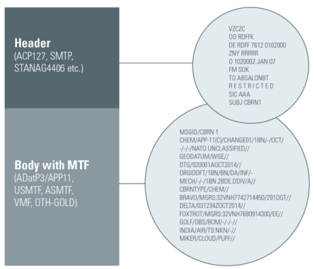
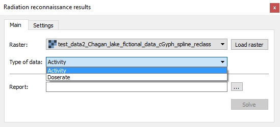
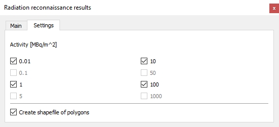
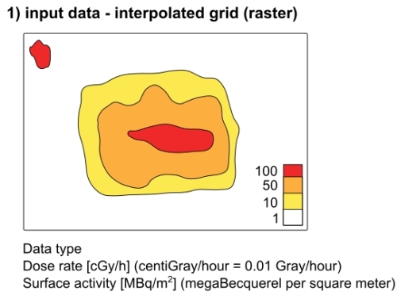
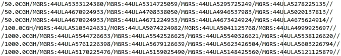

User Guide
**********

Introduction
------------

The plugin Radiation reconnaissance results uses interpolated radiation map in 
raster format as input data. In first step it generates isolines in preset 
levels and afterwards converts them into polygons and simplifies them to fit 
the limit of total 50 vertices per polygon (in fact it is 49 as first and last 
vertex has to have the same coordinates to close the polygon) for the text 
message. The output is text file in NATO APP-11 and ATP-45 compatible format 
and is then used as a part of a military MTF message.

   MTF message.

Plugin was developed following the specifications and with the help provided 
by the specialists of `the 314th NBC Warning Centre in Hostivice <http://www.army.cz/en/ministry-of-defence/newsroom/news/military-radiation-monitoring-net-activated-for-training-exercise-131399/>`__, Armed Forces of the Czech Republic (`ACR <http://www.army.cz/en/>`__) and 
National Radiation Protection Institute (`SÚRO <http://www.suro.cz/>`__).

GUI
---

The plugin is divided into two tabs. The first of them is ``Main`` tab:

   The main tab of plugin.

* User selects the raster input and chooses appropriate input type (dose rate 
  or surface activity). The raster combo box includes available layers from the 
  Layer panel or it is possible to upload a raster file via button ``Load 
  raster``. By hitting this button, a file dialog opens and user can choose 
  desired file (only GDAL supported files are shown). Pressing ``OK`` will 
  insert this path to the raster selection. Click on ``Cancel`` will interrupt 
  the choosing dialog and the raster selection will not be changed.

* Click on a tool button ``...`` opens a file dialog where user defines the 
  path where the report file will be saved. This file is mandatory so ``Solve`` 
  button is disabled until path is defined.

* After pressing ``Solve`` button, plugin generates simplified polygons and 
  saves output file(s) to selected destination(s).

The second tab of the plugin is ``Settings`` tab:

   The settings tab.

* This tab shows levels used for isolines generation. By default all levels 
  available for selected input type are checked but user can uncheck particular 
  ones.

* For dose rates the preset levels are 0.1, 1, 5, 10, 50, 100 and 1000 cGy/h. 

* For surface activities the preset levels are 0.01, 1, 10, 100 MBq/m2.

* The last check box allows user to decide if file of simplified polygons 
  should be created. This output is optional but by default the check box is 
  checked.

Input data
----------

   Input file.

A raster grid of dose rate or surface activity with a format supported by 
`GDAL library <http://www.gdal.org/formats_list.html>`__. Dose rate grid units 
has to be in cGy/h (centiGray/hour = 0.01 Gray/hour), surface activities in 
MBq/m2 (megaBecquerel per square meter).

Output data
-----------

* Report (mandatory)
  Structure of the output text report is following:

  /[VALUE][UNIT]/MGRS:[COORDINATE]/MGRS:[COORDINATE]/MGRS:[COORDINATE]//
  
  where: 
  
  * VALUE = dose rate value or surface activity value; decimal separator is 
    dot 
  * UNIT = used unit in XYH format; where X = C (centi), M (mili), U (micro); 
    Y = G (gray), S (sievert); or BQM2 (becquerel per square meter) 
  * COORDINATE = coordinates in MGRS system, alphanumeric characters
  
  
  All text must be in capital letters. The report must begin with a slash, 
  everything between two slashes is called a field. Field 1 can contain up to 12 
  characters. Field 2 can have up to 50 reps (maximum 50 coordinates), and each 
  field can contain up to 15 characters behind the MGRS identifier (eg. 
  accuracy in meters). The last coordinate ends with a double slash (indicates 
  the end of a line). Everything between the first slash and the double slash is 
  called a line. Individual lines must be separated by line break. There must be 
  no space before or behind the slash. There is no space between VALUE and UNIT. 
  There is no space between "MGRS:" and the coordinate, the colon must be 
  retained.
  
  The output may contain multiple rows, each being related to another level of 
  the measured variable (eg, 3 rows sequentially for 1CGH, 10CGH and 50CGH).

   Output report.
   
* File of simplified polygons (optional)
  
  File of polygons in format Esri Shapefile (.shp) is created if check box is 
  checked. It is saved in the same directory as input raster file.

 .. figure:: images/output_polygons.jpg

   File of simplified polygons.